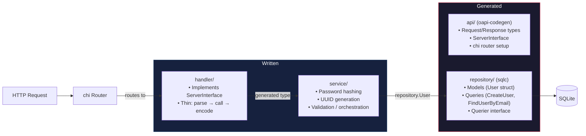

# Architecture

## Overview

A privacy-first, self-hostable web application for managing financial
investments, tracking portfolios, and maintaining research on potential
investments. Designed to minimise data exposure while giving users full control
over their data, including optional anonymous public sharing.

## Core Principles

1. **Privacy first** — No unnecessary PII, no third-party tracking, all data
   under user control
2. **Self-hostable by design** — Minimal external dependencies, simple Docker
   deployment, works in low-resource environments
3. **Simplicity over complexity** — Clear abstractions, avoid premature
   optimisation, add complexity only when justified
4. **Modular architecture** — Separation of concerns across layers, clear domain
   boundaries

## Tech stack

| Component  | Technology                             |
| ---------- | -------------------------------------- |
| Backend    | Go + Chi router                        |
| Database   | SQLite (via golang-migrate + sqlc)     |
| Frontend   | Nuxt.js (Vue 3) — *not yet implemented* |
| API format | JSON:API (`application/vnd.api+json`)  |

## Core domains

### 1. Portfolio management

- Instrument (equity, commodity, debt)
- Transaction (buy/sell)
- Holding (derived, not stored)
- Aggregate transactions, compute portfolio metrics (total investment,
  average cost, current value, P&L)

### 2. Watchlist & research

- Track companies and investment ideas
- Store fundamental metrics (PE, ROE, etc.)
- Maintain notes and investment thesis

### 3. Privacy & sharing

- Snapshot system: Portfolio → Snapshot → Public URL
- Random identifiers, no linkage to user identity, read-only

### 4. Authentication

- Username + password, bcrypt hashing, JWT tokens
- Local only, no third-party identity providers

## File layout (post-oapi-codegen)

```
server/
├── cmd/server/main.go          # Entrypoint — wires everything, starts server
├── api/
│   ├── openapi.yaml             # Hand-written — API contract (OpenAPI 3.x)
│   └── oapi-codegen.yaml        # Hand-written — codegen config
├── internal/
│   ├── api/                     # GENERATED by oapi-codegen
│   │   ├── types.gen.go         #   Request/response structs
│   │   ├── server.gen.go        #   ServerInterface + chi router
│   │   └── spec.gen.go          #   Embedded spec
│   ├── handler/                 # Hand-written — implements ServerInterface
│   │   ├── users.go
│   │   └── users_test.go
│   ├── service/                 # Hand-written — business logic
│   │   ├── user.go
│   │   └── user_test.go
│   ├── repository/              # GENERATED by sqlc
│   │   ├── db.go
│   │   ├── models.go
│   │   ├── querier.go
│   │   └── user.sql.go
│   ├── config/
│   │   └── config.go
│   ├── logger/
│   │   └── logger.go
│   └── app/
│       └── application.go
├── db/
│   ├── migrations/
│   ├── query/
│   │   └── user.sql
│   └── arthika.db
├── go.mod
├── go.sum
├── sqlc.yaml
└── Taskfile.yml
```

Legend:

- **Hand-written** — you own this, it's in version control
- **GENERATED** — produced by a codegen tool, re-run when the source changes

## Request lifecycle



## Layer responsibilities

| Layer        | Package                 | Source         | Owns                                                               | Does NOT own                        |
| ------------ | ----------------------- | -------------- | ------------------------------------------------------------------ | ----------------------------------- |
| **API types**    | `internal/api/`           | oapi-codegen   | Request/response structs, HTTP validation                          | Business logic, DB access           |
| **Handler**      | `internal/handler/`       | You            | Implements `ServerInterface`, calls service, writes response       | Business logic, DB queries          |
| **Service**      | `internal/service/`       | You            | Business rules, hashing, UUID gen, multi-step orchestration         | HTTP parsing, response encoding     |
| **Repository**   | `internal/repository/`    | sqlc           | Type-safe SQL queries, connection management                       | Business logic, HTTP concerns       |
| **Config**       | `internal/config/`        | You            | Env-var loading, struct config                                     | Everything else                     |
| **Logger**       | `internal/logger/`        | You            | Structured JSON logger to stdout                                   | —                                   |
| **App**          | `internal/app/`           | You            | Server lifecycle (start/stop), DB open, migrations                 | Route registration, business logic  |

## Request walkthrough: `POST /users/register`

```
Client                          chi Router                     handler.UserHandler
  │                                │                                  │
  │  POST /users/register          │                                  │
  │  Content-Type: application/json│                                  │
  │───────────────────────────────>│                                  │
  │                                │  route matched                   │
  │                                │─────────────────────────────────>│
  │                                │                                  │
  │                                │  Parse & validate request body   │
  │                                │  (generated by oapi-codegen)     │
  │                                │  e.g. api.CreateUserRequest{     │
  │                                │    Username, Email, Password     │
  │                                │  }                               │
  │                                │                                  │
  │                                │         service.CreateUser()     │
  │                                │         (ctx, req.Username,      │
  │                                │          req.Email, req.Password)│
  │                                │─────────────────────────────────>│
  │                                │                                  │
  │                                │              │                   │
  │                                │              │  hash password    │
  │                                │              │  generate UUID    │
  │                                │              │  INSERT via sqlc  │
  │                                │              ▼                   │
  │                                │              │                   │
  │                                │    ◄── repository.User ──────────│
  │                                │                                  │
  │                                │  Map to generated response type  │
  │                                │  api.UserResponse{ID, Username,  │
  │                                │    Email, CreatedAt}             │
  │                                │                                  │
  │  201 Created                   │                                  │
  │  Content-Type: application/json│                                  │
  │◄───────────────────────────────│                                  │
```

## Migration path from current state

### When oapi-codegen is wired in, these get **deleted**:

| Path                  | Reason                                  |
| --------------------- | --------------------------------------- |
| `internal/dto/*`      | Replaced by `internal/api/` generated types |

### These get **refactored**:

| Path                    | Change                                                                                                                                       |
| ----------------------- | -------------------------------------------------------------------------------------------------------------------------------------------- |
| `internal/handler/*.go` | Implements generated `ServerInterface` instead of hand-rolled handlers. Methods become thinner — incoming request is already parsed by generated code |
| `cmd/server/main.go`    | Uses `api.HandlerFromMux()` to register routes instead of manual `router.Post()` calls                                                      |

### These **stay as-is**:

| Path                        | Reason                                      |
| --------------------------- | ------------------------------------------- |
| `internal/service/*.go`     | Business logic — no codegen can replace this |
| `internal/repository/*.go`  | sqlc already handles this                    |
| `internal/config/*.go`      | No change needed                             |
| `internal/logger/*.go`      | No change needed                             |
| `internal/app/*.go`         | No change needed                             |

## Migration plan

### Completed — cleanup before oapi-codegen

- [x] Remove `service.User` struct and `GetUser()` from interface + impl
- [x] Remove `TestUserService_GetUser` and `TestUserService_InterfaceCompliance`
- [x] Remove `UserResponse`, `GetUser()`, `LoginUser()` from handler; drop unused imports
- [x] Remove `createJWT()` + unused imports from handler/utils.go
- [x] Update handler test mock and remove GetUser tests
- [x] Remove routes (`GET /users/`, `POST /login`, `GET /scratch/`) + unused imports from main.go
- [x] Delete `internal/middleware/.gitkeep`
- [x] `go test ./...` and `task lint` pass

Remaining route: `POST /users/register`

### Pending — oapi-codegen integration

- [ ] Install oapi-codegen: `go install github.com/oapi-codegen/oapi-codegen/v2/cmd/oapi-codegen@latest`
- [ ] Create `server/api/openapi.yaml` — spec for the register endpoint
- [ ] Create `server/oapi-codegen.yaml` — config (package: api, output: api/, chi-server + models + embedded-spec)
- [ ] Run `oapi-codegen --config=oapi-codegen.yaml api/openapi.yaml` and verify generated code
- [ ] Add oapi-codegen to Taskfile.yml `generate` task
- [ ] Add oapi-codegen runtime dependency: `go get github.com/oapi-codegen/runtime`
- [ ] Refactor `internal/service/user.go` — update interface to use generated types
- [ ] Refactor `internal/handler/users.go` — implement generated `ServerInterface`
- [ ] Refactor `cmd/server/main.go` — use `HandlerFromMux` for chi route registration
- [ ] Delete `internal/dto/` package entirely
- [ ] Update tests for generated types
- [ ] Remove unused dependencies from go.mod
- [ ] Run `task lint` and `go test ./...` to verify

### Key design rule

> **The handler is the only layer that imports `internal/api/` (generated types).**
>
> The service layer imports `internal/repository/` (sqlc models) and returns them directly.
> The handler maps `repository.User` → `api.UserResponse` in a thin translation.
>
> This keeps the generated types isolated to the transport layer, so changes to the API
> contract never ripple into your business logic.

## Deployment

- Docker support (Go single binary)
- Database: SQLite (embedded, no external process)
- Reverse proxy: optional (e.g., Caddy)

## Testing strategy

### Backend

- **Service tests** — unit tests with mocked repository (all use `t.Parallel()`)
- **Handler tests** — black-box via `httptest`, mock the service interface
- **Repository** — tested implicitly through service tests; integration tests
  added when justified

### Frontend (planned)

- Component-level testing
- Optional end-to-end testing

## Observability

- **Logging** — structured JSON via `slog` to stdout, no sensitive data
- **Metrics** — local-only collection, optional (not yet implemented)
